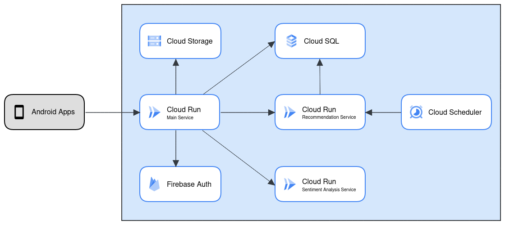

<h1 align="center">
  <br>
    
  <br>
    Traversee ID
  <br>
    <small style="font-size: 16px"><em>Discover The Unforgettables</em></small>
</h1>

## Table of Contents
- [Table of Contents](#table-of-contents)
- [Deployment Architecture](#deployment-architecture)
- [Project Structure](#project-structure)
- [API Documentation](#api-documentations)

## Deployment Architecture
The deployment architecture of this project can be seen in the image below.


## Project Structure
```
┌───api
│   ├───v1
│   │   ├───models
│   │   │   ├───__init__.py
│   │   │   ├───campaigns.py
│   │   │   ├───forums.py
│   │   │   ├───open_trips.py
│   │   │   └───tourisms.py
│   │   ├───routes
│   │   │   ├───__init__.py
│   │   │   ├───campaigns.py
│   │   │   ├───forums.py
│   │   │   ├───open_trips.py
│   │   │   ├───profiles.py
│   │   │   └───tourisms.py
│   │   ├───__init__.py
│   │   ├───decorator.py
│   │   ├───extensions.py
│   │   └───helper.py
├───credentials.py
└───main.py
```

## API Documentation
The details of the API documentation can be accessed at [here](https://documenter.getpostman.com/view/2s93sc4spc).